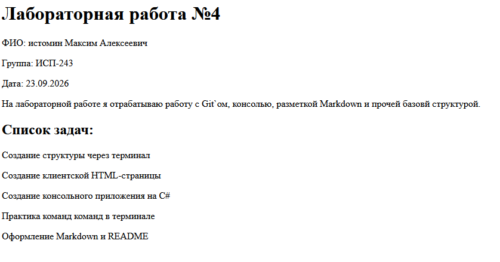
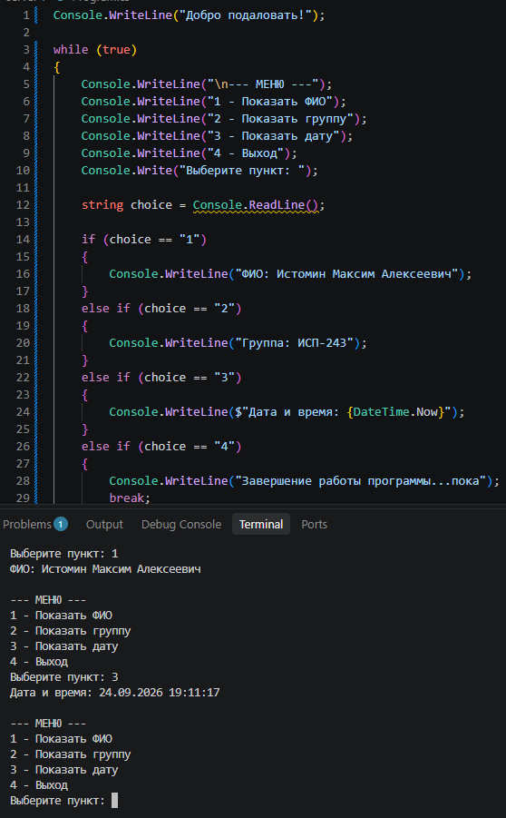
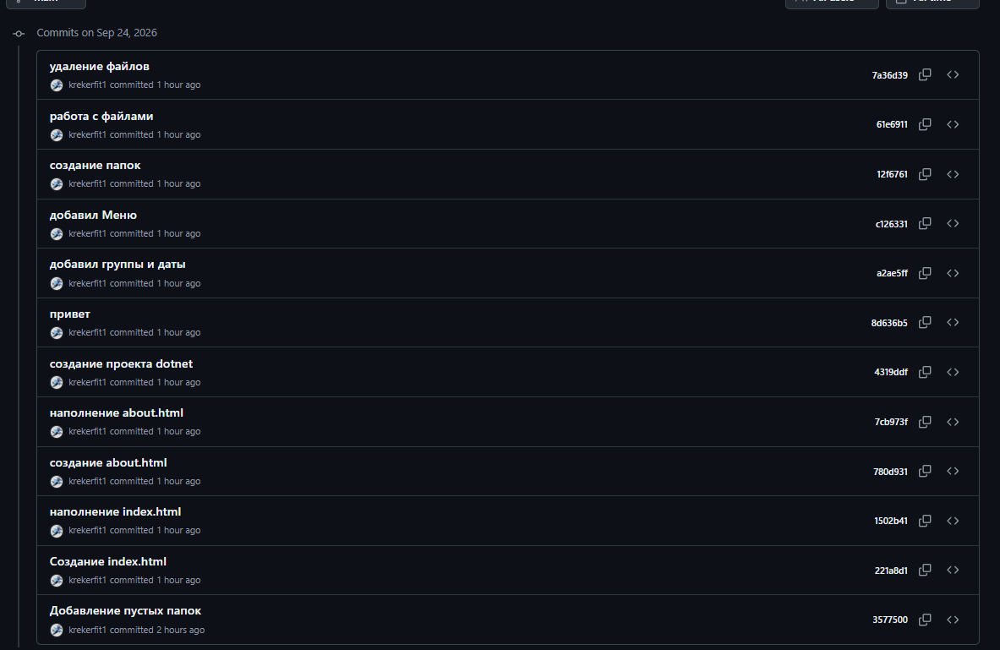

# Лабораторная работа №4. 

**Выполнил(а):** Истомин Максим Алексеевич
**Группа:** ИСП - 243
**Дата выполнения:** 24.09.2026

---

##  Описание проекта

В данном репозитории находится моя первая самостоятельная работа по дисцеплине ISRPO, в ней присутствует работает с html, markdown, C# и работа с git терминалом.

---

## 📖 Содержание

- [Описание проекта](#-описание-проекта)
- [Структура проекта](#-структура-проекта)
- [Примеры Markdown](#-примеры-markdown)
- [Пример формул LaTeX](#-пример-формул-latex)
- [Ссылка на репозиторий](#-ссылка-на-репозиторий)
- [Скриншоты](#-скриншоты)
- [Заключение](#-заключение)

---

## Структура проекта


---

##  Примеры Markdown

### Заголовок

Заголовки в Markdown создаются символом `#`:

```markdown
# Заголовок H1
## Заголовок H2
### Заголовок H3
```

### Список

- маркированный пункт 1
- маркированный пункт 2
- вложенный пункт

1. нумерованный пункт 1
2. нумерованный пункт 2

### Картинка


### Код

```
Console.WriteLine("Hello, Lab4!");
```


---

## ∑ Пример формул 

площадь круга вычисляется по формуле $S = \pi r^2$.

Еще формула:

$$
\sum_{i=1}^{n} i = \frac{n(n+1)}{2}
$$

---

## Ссыль на репозиторий

Репозиторий проекта:(https://github.com/krekerfit1/Laba4_ISRPO_Istomin.git)

---

## Скриншоты

**Страница index.html в браузере:**


**Работа консольного приложения (dotnet run):**



**Структура проекта в терминале:**


**История коммитов на GitHub:**



---

## Заключение

В ходе выполнения лабораторной работы №4 были закреплены навыки:

- создания и настройки Git-репозитория с регулярными коммитами;
- построения дерева проекта через терминал;
- разработки простого фронтенда на HTML;
- создания консольного приложения на C#;
- работы с файловой системой через терминал ;
- оформления документации с использованием Markdown и LaTeX.

.